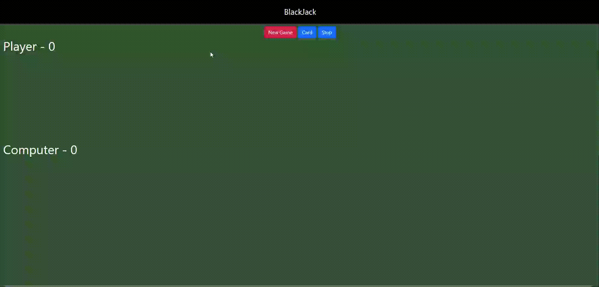

# javascript-course
This repository contains my progress as I follow a JavaScript course, including exercises, projects, and notes to reinforce my learning. It serves as a personal study log where I practice core concepts, explore advanced topics, and document my journey in mastering JavaScript.

## 01 - BlackJack

This is a simple Blackjack game I built to practice and reinforce my JavaScript skills. The project covers core concepts such as variable types, loops, regular and arrow functions, and basic DOM manipulation. It also includes working with images and updating the interface dynamically. This hands-on project helped me understand how to bring together different JavaScript elements in a functional mini-game.

